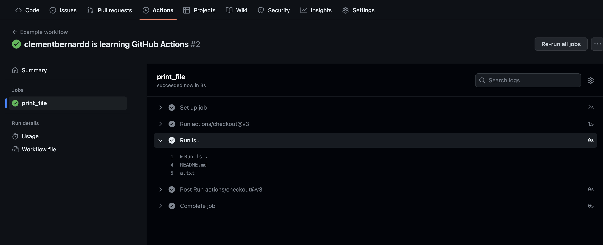

# Github Actions

GitHub Actions is a continuous integration and continuous delivery (CI/CD) platform that allows you to automate your build, test, and deployment pipeline. 
You can create workflows that build and test every pull request to your repository, or deploy merged pull requests to production.
GitHub provides Linux, Windows, and macOS virtual machines to run your workflows.

## Components of Github Actions
You can configure a GitHub Actions workflow to be triggered when an event occurs in your repository, such as a pull request being opened or an issue being created. 
Your workflow contains one or more jobs which can run in sequential order or in parallel. 
Each job will run inside its own virtual machine runner, or inside a container, and has one or more steps that either run a script that you define or run an action, which is a reusable extension that can simplify your workflow.


### Workflows

A workflow is a configurable automated process that will run one or more jobs. 
Workflows are defined by a YAML file checked in to your repository and will run when triggered by an event in your repository, or they can be triggered manually, or at a defined schedule.

Workflows are defined in the `.github/workflows` directory in a repository, and a repository can have multiple workflows, each of which can perform a different set of tasks. 
For example, you can have one workflow to build and test pull requests, another workflow to deploy your application every time a release is created, and still another workflow that adds a label every time someone opens a new issue.

### Events

An event is a specific activity in a repository that triggers a workflow run. 
For example, activity can originate from GitHub when someone creates a pull request, opens an issue, or pushes a commit to a repository. 

### Jobs

A job is a set of steps in a workflow that is executed on the same runner. 
Each step is either a shell script that will be executed, or an action that will be run. 
Steps are executed in order and are dependent on each other. 
Since each step is executed on the same runner, you can share data from one step to another. 
For example, you can have a step that builds your application followed by a step that tests the application that was built.

### Actions

An action is a custom application for the GitHub Actions platform that performs a complex but frequently repeated task. 
Use an action to help reduce the amount of repetitive code that you write in your workflow files. 
An action can pull your git repository from GitHub, set up the correct toolchain for your build environment, or set up the authentication to your cloud provider.

You can write your own actions, or you can find actions to use in your workflows in the GitHub Marketplace.


## Create an example workflow

GitHub Actions uses YAML syntax to define the workflow. 
Each workflow is stored as a separate YAML file in your code repository, in a directory named `.github/workflows`.

- In your repository, create the `.github/workflows/` directory to store your workflow files.
- In the `.github/workflows/` directory, create a new file called `example_workflow.yml` and add the following code:

```yaml
name: Example workflow
run-name: ${{ github.actor }} is learning GitHub Actions
on: [push]
jobs:
  print_file:
    runs-on: ubuntu-latest
    steps:
      - uses: actions/checkout@v3
      - run: ls .
```

Explanation of the content: 

| --- | --- | 
| `name: Example workflow` | Optional - The name of the workflow as it will appear in the "Actions" tab of the GitHub repository. | 
| `run-name: ${{ github.actor }} is learning GitHub Actions` | Optional - The name for workflow runs generated from the workflow, which will appear in the list of workflow runs on your repository's "Actions" tab. This example uses an expression with the github context to display the username of the actor that triggered the workflow run. |
| `on: [push]` | Specifies the trigger for this workflow. This example uses the push event, so a workflow run is triggered every time someone pushes a change to the repository or merges a pull request | 
| `jobs` | Groups together all the jobs that run in the workflow. | 
| `print_file` | Defines a job named check-bats-version. | 
| `runs-on: ubuntu-latest` | Configures the job to run on the latest version of an Ubuntu Linux runner. This means that the job will execute on a fresh virtual machine hosted by GitHub. | 
| `steps` | Groups together all the steps that run in the job. Each item nested under this section is a separate action or shell script.| 
| `- uses: actions/checkout@v3` | The uses keyword specifies that this step will run v3 of the actions/checkout action. This is an action that checks out your repository onto the runner, allowing you to run scripts or other actions against your code (such as build and test tools). You should use the checkout action any time your workflow will run against the repository's code. | 
| `- run: ls .` | The run keyword tells the job to execute a command on the runner. In this case, it just lists the current directory. |

- Commit these changes and push them to your GitHub repository.

### Visualize the activity of a workflow

When your workflow is triggered, a workflow run is created that executes the workflow. 
After a workflow run has started, you can see a visualization graph of the run's progress and view each step's activity on GitHub.

- On GitHub.com, navigate to the main page of the repository.
- Under your repository name, click  Actions.

- In the left sidebar, click the workflow you want to see.




### Source

- Official [link](https://docs.github.com/en/actions/learn-github-actions/understanding-github-actions)