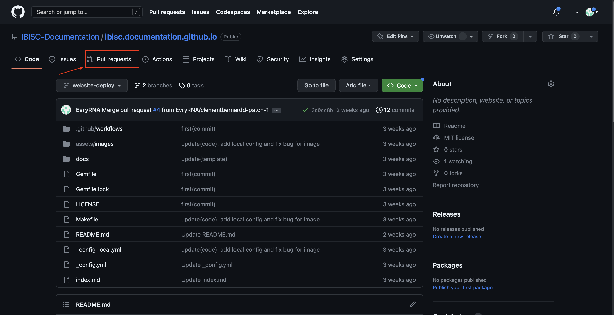

## Contribution

If you want to contribute, please follow theses steps: 
1. Ensure you are part of the [IBISC-Documentation organisation](https://github.com/IBISC-Documentation)
2. Create a branch or fork the [repo](https://github.com/IBISC-Documentation/ibisc.documentation.github.io). As convention, please use `name-subject`. For instance, if my name is Lisa and I want to write a page on pytorch, create a branch names `lisa-pytorch`.
3. Do all the modifications you want on the `docs` directory. You should not modify other files unless there is a clear reason. 
4. Check that the website runs locally and the page you added/modified displays as you wanted to. 
5. Do a pull request to `website-deploy` branch, and wait until someone has verified your contribution. This is to ensure that the deployment branch has verified contents.
6. Enjoy your changes on the website (it can take few minutes to be updated once the pull request has been accepted): [Website](https://ibisc-documentation.github.io/ibisc.documentation.github.io/)


## Example

Let's see step by step how to contribute. For the example, we will add a markdown page with just a title "Example".

### 1. Organisation

I assume the first step (being in the IBISC organisation) is already done. 


### 2. Create a branch
Let's create a directory where we will clone the repo. 

```
mkdir ibisc-doc
cd ibisc-doc
```

Let's clone the repo: 
```
git clone https://github.com/IBISC-Documentation/ibisc.documentation.github.io.git
```

Now I can create a branch, following the convention of names. As an example, I will create the branch `admin-example`, as I am the administrator and I will contribute to an `example`. 

Please change the name and the branch for your case.

```
git checkout -b admin-example
```

It will create the branch and checkout to this branch directly. 

### 3. Do all the modifications

I will create a page. The page should have a `title`, `layout` and `nav_order`. The `title` is the name of the page, `layout` is the reference page (`home` usually) and the `nav_order` the order in the home page. 

Let's create a directory where the markdown will be: 
```
mkdir docs/example
```

Open your favorite IDE and create a `docs/example/example.md` file. For instance: 
```
vim docs/example/example.md
```
Then, you can paste the following content: 
```
---
title: Example
layout: home
nav_order: 2
---

# Example

This page is an example
```

You can now commit this change: 
```
git add docs/example/example.md
git commit -m 'add(example): an example file for the tutorial'
```

Then, you can push to the branch: 
```
git push origin admin-example
```


### 4. Run locally

We can now see the changes. Let's run locally the website by doing: 
```
make run
```
If you have a Windows computer, it won't work. To run it Manually, use: 

```
bundle install
bundle exec jekyll serve -c _config-local.yml
```
You can now see the changes in the address [localhost](127.0.0.1:4000). 

You should see something like that: 


### 5. Do a Pull Request

You can now do a Pull Request. 

Go to the [github page](https://github.com/IBISC-Documentation/ibisc.documentation.github.io).

Click on the Pull Request: 



Create a new Pull Request: 


Choose the good branch to compare: 


We select the `admin-example` branch: 


We can then create the PR by clicking on the `Create pull request` button: 


It will then open a page with the PR summary. The name of the PR usually is, by default, the name of the last commit. Please change it to a more precise name: 


Then, you can create the PR by clicking on the `Create pull request` button: 


It will then open the page with the PR. You would need to wait until someone has accepted the PR before seeing the results in the official website. 


If you have any question, don't hesitate to ask in the Discord OR to open a Github Issue. 


----

